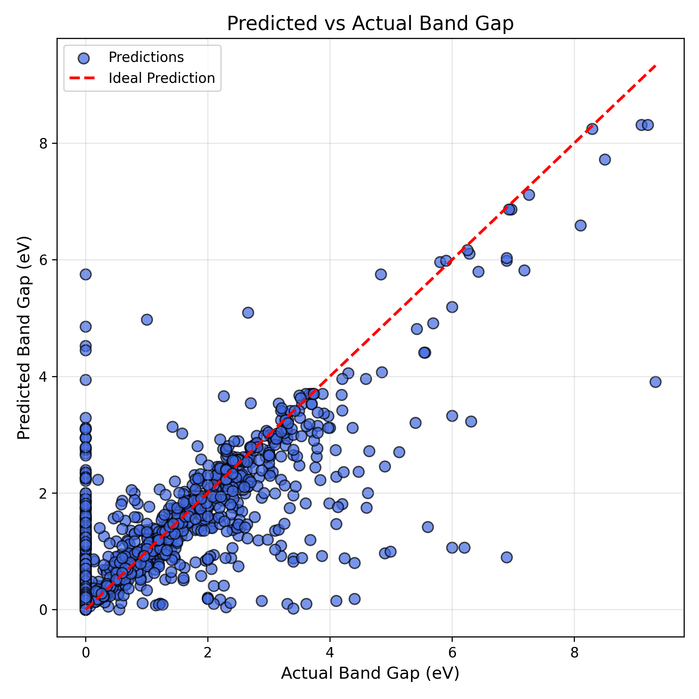

# Materials Band Gap Prediction

Machine learning model to predict experimental band gaps of materials using composition-based descriptors.

## Workflow

1. Load materials dataset
2. Extract composition-based features
3. Train machine learning regression model
4. Evaluate prediction performance

## Prediction Results

